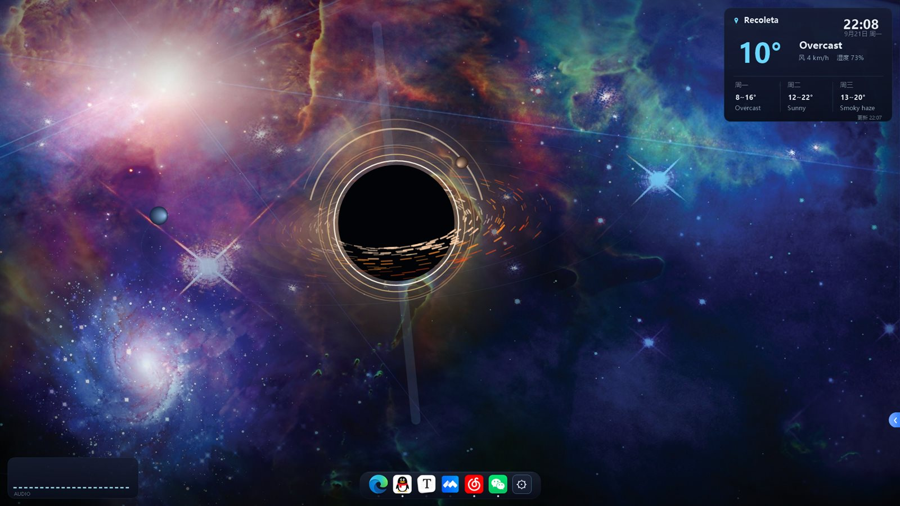
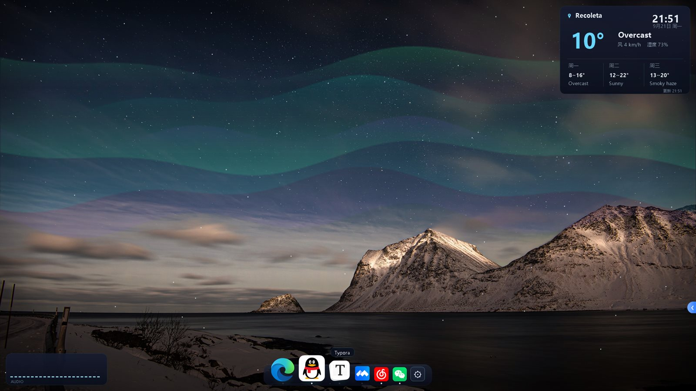

<div align="center">


# ZPapaer · 桌面美化套件

**🌧️ 动态壁纸 · 🚀 Mac 式 Dock · 🧩 桌面小组件**

*原生 Win32/.NET 单文件实现 · 零第三方依赖 · 常驻内存约 90 MB*




*黑洞吸积盘主题实机截图：380 粒子开普勒吸积盘 + 光子环 + 引力透镜弧 + 极向喷流，全部 GDI+ 实时绘制*

📥 **下载即用** → [Code ▾ · Download ZIP](https://github.com/su1less/ZPaper/archive/refs/heads/main.zip) → 整体解压 → 双击 `ZPapaer.exe`（Win10/11 免安装任何运行时）

</div>

---

## ✨ 它能做什么

### 🌧️ 动态壁纸 —— 会呼吸的桌面

- 挂载 WorkerW 壁纸层，不干扰图标与鼠标；4 套主题随时切换
- **与 wttr.in 实时天气联动**：窗外真下雨，你的桌面也在下雨，雨量风力跟随真实天气
- 全屏应用/游戏自动暂停渲染；每 3 分钟自动压缩内存

### 🚀 Mac 式 Dock —— 任务栏的华丽替代

- UpdateLayeredWindow 逐像素透明 + 半隐式欧拉弹簧放大，60fps 丝滑
- 末端 ⚙ 菜单：🔊 音量滑块、🌐 WiFi 直连（免管理员）、🎨 切主题、临时显示任务栏、退出
- 🔍 搜索启动器：亚克力半模糊背景，回车即启动
- 应用有多个窗口？点击图标弹出窗口列表任你选
- 全屏自动隐藏，鼠标贴住屏幕底边 0.5s 呼出；运行中的应用自动上船，右键可固定

### 🧩 桌面小组件

- 右上：天气 + 时钟（定位城市 / 湿度 / 三日预报）
- 左下：WASAPI 音量律动条，音乐一响就跳舞
- 「显示桌面」也最小化不了它们（SC_MINIMIZE 拦截 + 看门狗）

## 🎨 四套主题

| 🌃 雨夜霓虹城市 | 🌌 极光雪夜 | 💫 深空星云 | 🕳️ 黑洞吸积盘 |
|---|---|---|---|
|  |  |  |  |

## 📸 实机一览

| 极光雪夜 · Dock 悬停放大 | 雨夜霓虹 · 雨量跟随真实天气 |
|---|---|
|  |  |

## 📥 快速开始

1. 仓库页面 **Code → Download ZIP**（或 `git clone`），**整体解压** —— `ZPapaer.exe` 必须与 `bg/` 底图同层，单独拷走 exe 无法出图
2. 双击 `ZPapaer.exe`：原生任务栏自动隐藏，壁纸/Dock/小组件全部就位（exe 文件名保留了项目更名期的历史拼写）
3. 开机自启：`Win+R` → `shell:startup` → 放入 ZPapaer.exe 的快捷方式
4. 固定应用到 Dock：把 .lnk 快捷方式丢进 `dockApps/` 即自动上船
5. 退出：Dock 末端 ⚙ → 退出（自动恢复原生任务栏）

## 🛠️ 从源码编译

```bat
C:\Windows\Microsoft.NET\Framework64\v4.0.30319\csc.exe -nologo -target:winexe ^
  -platform:anycpu -codepage:65001 -win32icon:app.ico -out:ZPapaer.exe ^
  -r:System.dll -r:System.Drawing.dll -r:System.Windows.Forms.dll -r:System.Web.Extensions.dll ^
  TechRainWallpaper.cs
```

无需 VS、无需 NuGet，任何一台 Windows 自带的 .NET Framework 编译器即可构建。改图标后先跑 `tools/gen_icon.exe` 重新生成 `app.ico`。

## 📁 目录结构

```
ZPaper/
├── TechRainWallpaper.cs        全部源码（壁纸场景/Dock/小组件/启动器/音量/网络）
├── ZPapaer.exe                 编译好的主程序，下载即用
├── app.ico                     程序图标（tools/gen_icon.cs 生成）
├── bg/                         四套主题底图 city1 / aurora1 / nebula1 / nebula2
├── dockApps/                   Dock 固定应用（放入 .lnk 即自动上船）
├── docs/                       图标资产与 README 展示截图
├── scripts/                    部署 / 验证 PowerShell 脚本
└── tools/                      90+ 个排障诊断工具源码（窗口检查/菜单自动化/端到端测试）
```

## 🩺 改代码前必读

<details>
<summary><b>已知问题与关键实现坑（点击展开）</b></summary>

**⭐ 唤醒策略铁律（2026-09-24 两次实测教训）**：dock 图标唤醒应用，能直连恢复的绝不走托盘舞步——托盘路径慢（秒级）且 bug 多。仅 QQ / 微信 / ZCode 三壳允许托盘路径（外部恢复会变输入死寂僵尸，实测结论）；其余一律直连恢复（~1s）。`TrayResidents` 会把应用拉回托盘路径，网易云曾被翻回去，现由 `DirectRestore` 名单强制压回。**禁止再扩大托盘路径适用范围。**

**微信/QQ 僵尸窗口病例史**：登录窗误选✅、误启动新实例✅、隐形点击膜✅、破损渲染✅、忙进程挂死✅ 均已修；残留：微信主窗偶发"画完但输入路由未醒"（单击被吞双击才响），已验证 WM_ACTIVATE/TAB/搜索框点击无效，有效缓解=激活链中真实标题栏+客户区点击。候选根治方向：hook 微信托盘恢复回调 / UIA InvokePattern。

**关键实现坑**：
- 壁纸窗口挂 WorkerW；小组件是顶级窗口沉底（TransparencyKey 对 WorkerW 子窗口无效）
- 窗口透明一律 UpdateLayeredWindow 逐像素 Alpha（颜色键有紫边）
- WinForms 会被"显示桌面"最小化：拦截 SC_MINIMIZE + 看门狗
- 对目标窗口的同步调用可能被忙进程挂死：激活整段丢 ThreadPool；永不 AttachThreadInput；永不 PostMessage 伪造鼠标消息
- 弹簧积分：半隐式欧拉 + exp 精确阻尼 + dt 钳制，放大距离用静止位置算
- 合成输入驱动原生菜单（#32768）只有键盘序 DOWN×N + ENTER 可靠；FindWindowW 必须 CharSet.Unicode
- 日志是第一现场：每次图标点击的完整决策记录在 `log.txt` 的 `[ACT]` 段

</details>

---

<div align="center">

**ZPapaer** —— 用 GDI+ 和 Win32 一笔一笔画出来的桌面

如果它让你的桌面好看了一点，欢迎点一个 ⭐

</div>
